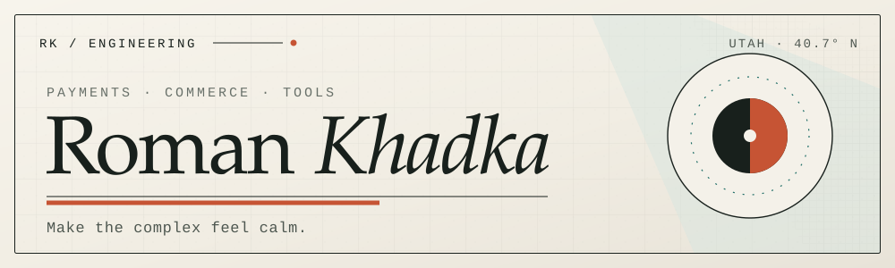
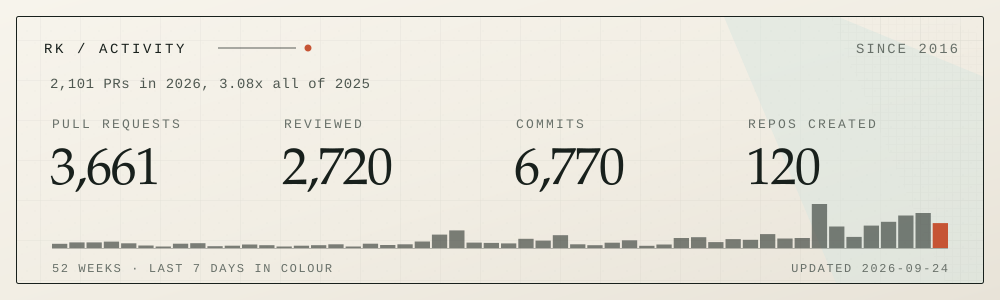

<picture>
  <source media="(prefers-color-scheme: dark)" srcset="./assets/hero-dark.svg">
  <source media="(prefers-color-scheme: light)" srcset="./assets/hero-light.svg">
  
</picture>

Engineer at **[Fluid](https://www.fluid.app)** · payment orchestration & commerce infrastructure · Utah · [romn.me](https://romn.me)

I work on the part of commerce where money actually moves: authorization and capture,
refunds, wallets, recurring billing, routing across a dozen gateways that all disagree
about what a webhook means.

The happy path is the easy part. The craft is in asynchronous state, duplicate messages,
partial failure, and making recovery boring enough that nobody gets paged for it. Most of
what I ship is a Rails monolith old enough to have opinions, kept understandable on
purpose.

Evenings I build small, sharp tools for the terminal and the Mac.

### Tools

<!-- Drop a terminal GIF under Yakka and Verso when you next record one. An 8-second
     asciinema cast converted to GIF converts readers into users better than any prose. -->

**[Yakka](https://github.com/romankhadka/yakka)**. Claude Code and Codex side by side in
one terminal, every session sealed in its own git worktree, the whole host detachable.
Rust. Prebuilt macOS and Linux binaries on
[Releases](https://github.com/romankhadka/yakka/releases).

**[Verso](https://github.com/romankhadka/verso)**. A terminal EPUB reader with vim
navigation, a Kindle-style library, and highlights that export as real Markdown into
Obsidian, Logseq, or Zotero. Rust.

```sh
brew install romankhadka/tap/verso
```

**[Lunar](https://github.com/romankhadka/lunar)**. Sets your wallpaper to tonight's moon
phase from public-domain NASA photography. No network, no telemetry, no preferences window.
Swift; [DMG on Releases](https://github.com/romankhadka/lunar/releases).

**[context-compactor](https://github.com/romankhadka/context-compactor)**. Watches a
Claude Code session and suggests `/compact` at decay-aware thresholds tuned per task type.

```
/plugin marketplace add https://github.com/romankhadka/context-compactor
```

**[Crux](https://github.com/romankhadka/crux-lang)**. A small expression-oriented language
with closures, pipes, and a tree-walk interpreter, written in Ruby to find out what a
language really needs.

### Toolbox

```text
LANGUAGES   Ruby · Rust · Swift
SYSTEMS     Rails · PostgreSQL · Redis · Sidekiq
INTERESTS   idempotency · async state · partial failure · terminal UI
```

### Activity

<picture>
  <source media="(prefers-color-scheme: dark)" srcset="./assets/stats-dark.svg">
  <source media="(prefers-color-scheme: light)" srcset="./assets/stats-light.svg">
  
</picture>

> **Good software should explain itself.** The rest is naming, restraint, and care.

If you try one of these and it breaks, open an issue. I read every one.
